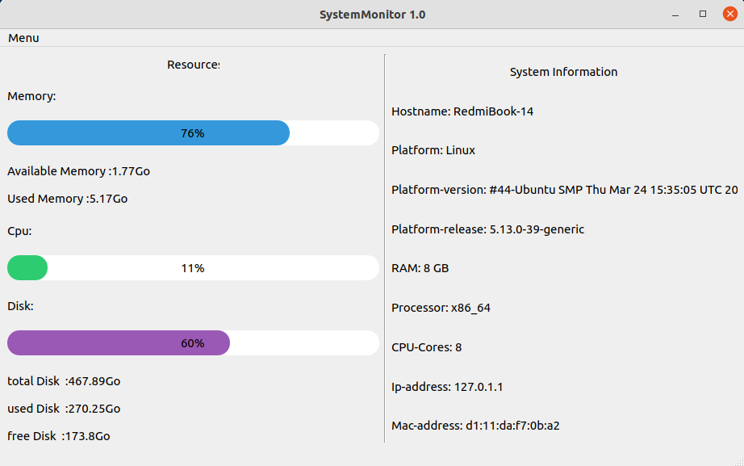

# System Monitor
<b>रैम, सीपीयू और हार्ड डिस्क उपयोग के लिए रीयल-टाइम मॉनिटरिंग प्रोग्राम। जीयूआई समर्थन के साथ पायथन में लिखा गया।</b>
<p>
  
  
  
  
  
  

  
  
  
</p>


Read in other languages: [English](README.md), [Russian](README.ru.md), [中國人](README.chinese.md)





## कैसे स्थापित करें और चलाएं
____
### रिपॉजिटरी को क्लोन करें
 
```sh
$ cmd
$ git clone https://github.com/BEPb/System_monitor
```
 
### आवश्यक पैकेज स्थापित करें (निर्भरता स्थापित करें)
```sh
$    -r requirements.txt
```

## उपयोग
टर्मिनल में, प्रोग्राम डायरेक्टरी में बदलें:
```
$ cd System_monitor
```
並輸入：
```
python sysmonitor.py
```
要啟動 GUI：
```
python main.py
```


