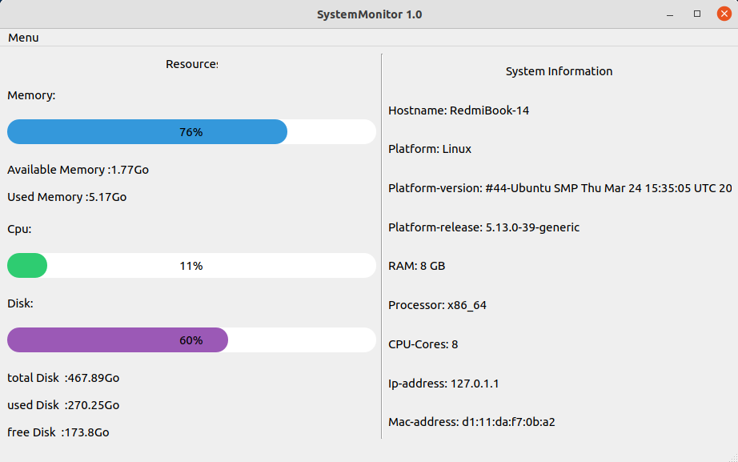

# SystemMonitor
<b>Python GUI program to monitor ram and cpu usage along with disk usage.</b>
<p>
  
  
  
  
  
  

  
  
  
</p>


Читать на других языках: [English](README.md), [हिन्दी](README.hindi.md), [中國人](README.chinese.md)





## Порядок установки и запуска                    
____
### Клонируем репозиторий (Clone the repository)
 
```sh
$ cmd
$ git clone https://github.com/BEPb/System_monitor
```
 
### Устанавливаем необходимые пакеты (Install dependencies)
```sh
$    -r requirements.txt
```

## Использование
В терминале перейдите в каталог программы:
```
$ cd System_monitor
```
и введите:
```
python sysmonitor.py
```
Чтобы запустить графический интерфейс:
```
python main.py
```


